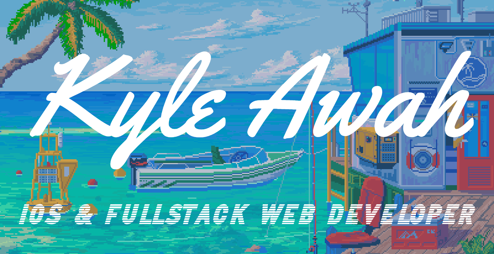

### Hey there! 👋🏼

 I'm Kyle a software developer from the little island of Trinidad 🇹🇹 in the Caribbean. I love to develop revolutionary software that impacts the world we experience every day! 

 &nbsp;
 &nbsp;

### Languages, Frameworks, Tools & More:
<image height="30px" src="icons/ajax.png"></image> &nbsp;
<image height="30px" src="icons/c%2B%2B.png"></image> &nbsp;
<image height="30px" src="icons/clogo.png"></image> &nbsp;
<image height="30px" src="icons/css.png"></image> &nbsp;
<image height="30px" src="icons/dart.png"></image> &nbsp;
<image height="30px" src="icons/figma.png"></image> &nbsp;
<image height="30px" src="icons/flask.png"></image> &nbsp;
<image height="30px" src="icons/flutter.png"></image> &nbsp;
<image height="30px" src="icons/git.png"></image> &nbsp;
<image height="30px" src="icons/gunicorn.png"></image> &nbsp;
<image height="30px" src="icons/htmllogo.png"></image> &nbsp;
<image height="30px" src="icons/jinja.png"></image> &nbsp;
<image height="30px" src="icons/jslogo.png"></image> &nbsp;
<image height="30px" src="icons/json.png"></image> &nbsp;
<image height="30px" src="icons/nuxt.png"></image> &nbsp;
<image height="30px" src="icons/pascal.png"></image> &nbsp;
<image height="30px" src="icons/php.png"></image> &nbsp;
<image height="30px" src="icons/plsql.png"></image> &nbsp;
<image height="30px" src="icons/poetry.png"></image> &nbsp;
<image height="30px" src="icons/postgres.png"></image> &nbsp;
<image height="30px" src="icons/python.png"></image> &nbsp;
<image height="30px" src="icons/react.png"></image> &nbsp;
<image height="30px" src="icons/sketch.png"></image> &nbsp;
<image height="30px" src="icons/sqalchemy.png"></image> &nbsp;
<image height="30px" src="icons/sql.png"></image> &nbsp;
<image height="30px" src="icons/sqlite.png"></image> &nbsp;
<image height="30px" src="icons/swift.png"></image> &nbsp;
<image height="30px" src="icons/swiftui.png"></image> &nbsp;
<image height="30px" src="icons/vue.png"></image> &nbsp;
<image height="30px" src="icons/wix.png"></image> &nbsp;
<image height="30px" src="icons/wordpress.png"></image> &nbsp;
<image height="30px" src="icons/xml.png"></image>
